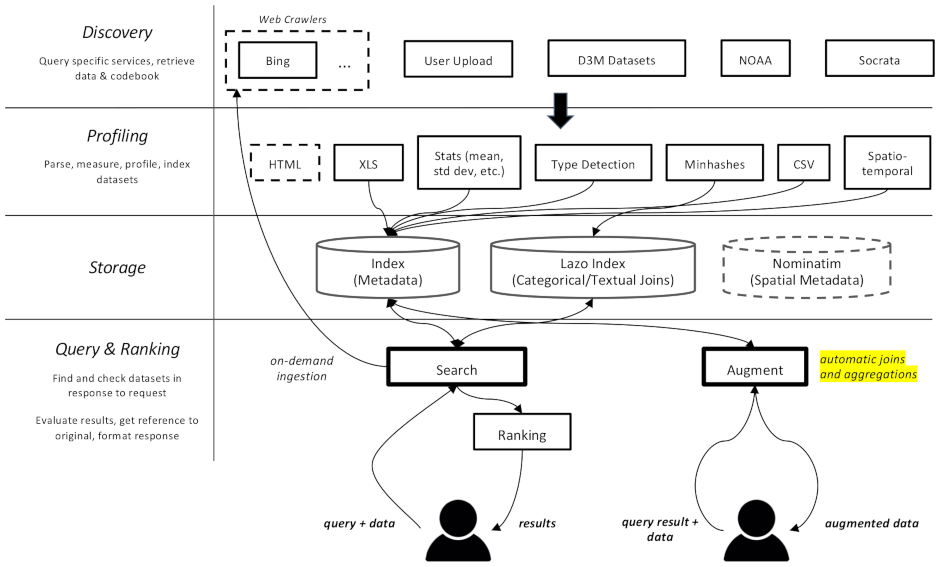
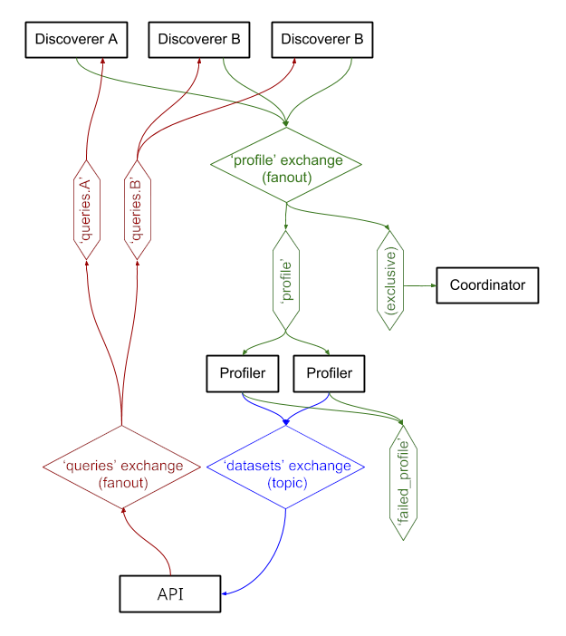

Datamart
========

This project is a web crawler and search engine for datasets, specifically meant for data augmentation tasks in machine learning. It is able to find datasets in different repositories and index them for later retrieval.

[Documentation is available here](https://docs.auctus.vida-nyu.org/)

It is divided in multiple components:

* Libraries
  * [Client library](https://gitlab.com/ViDA-NYU/datamart/api) `datamart`. This can be installed by clients to query the Datamart server. It is able to perform profiling and materialization locally, if the corresponding libraries are installed. This lives in a separate repository to ease collaboration.
  * [Profiling library](lib_profiler/) `datamart_profiler`. This can be installed by clients, will allow the client library to profile datasets locally instead of sending them to the server. It is also used by the query and profiler services.
  * [Materialization library](lib_materialize/) `datamart_materialize`. This is used to materialize dataset from the various sources that Datamart supports. It can be installed by clients, which will allow them to materialize datasets locally instead of using the server as a proxy.
  * [Data augmentation library](lib_augmentation/) `datamart_augmentation`. This performs the join or union of two datasets and is used by the query service, but could conceivably be used stand-alone.
  * [Core server library](lib_core/) `datamart_core`. This contains common code for services. Only used for the server components.
* Services
  * [**Discovery services**](discovery/): those are responsible for discovering datasets. Each plugin can talk to a specific repository. *Materialization metadata* is recorded for each dataset, to allow future retrieval of that dataset.
  * [**Profiler**](profiler/): this service downloads a discovered dataset and computes additional metadata that can be used for search (for example, dimensions, semantic types, value distributions). Uses the profiling and materialization libraries.
  * **Lazo Server**: this service is responsible for indexing textual and categorical attributes using [Lazo](https://github.com/mitdbg/lazo). The code for the server and client is available [here](https://gitlab.com/ViDA-NYU/datamart/lazo-index-service).
  * [**Query**](query/): this service responds to queries from clients by looking up datasets in the index, and can trigger on-demand query by discovery services that support it. It can also optionally profile a dataset if a client uploads it (if it couldn't profile it locally), and materialize it if the client requests it (if it can't materialize it locally). Uses the profiling and materialization libraries. Implements a JSON API using the Tornado web framework.
  * [The **coordinator**](coordinator/): this service is in charge of the dataset cache, where discovery plugins download datasets, and that is read by the profiler and query services. It also provides the monitoring facilities, showing a live feed of indexed datasets, and a user-friendly search interface.



Elasticsearch is used as the search index, storing one document per known dataset.

The services exchange messages through `RabbitMQ`, allowing us to have complex messaging patterns with queueing and retrying semantics, and complex patterns such as the on-demand querying.



Deployment
==========

The system is currently running at https://auctus.vida-nyu.org/. You can see the system status at https://grafana.auctus.vida-nyu.org/.

Local deployment / development setup
====================================

To deploy the system locally using docker-compose, follow those step:

Set up environment
------------------

Copy env.default to .env and update the variables there. You might want to update the password for a production deployment.

The `QUERY_HOST` is the URL at which the query containers will be visible to clients. In a production deployment, this is probably a public-facing HTTPS URL. It can be the same URL that the "coordinator" component will be served at if using a reverse proxy (see [nginx.conf](nginx.conf)).

Build the containers
--------------------

```
$ docker-compose build --build-arg version=$(git describe) coordinator profiler query socrata
```

Start the base containers
-------------------------

```
$ docker-compose up -d elasticsearch rabbitmq redis lazo
```

These will take a few seconds to get up and running. Then you can start the other components:

```
$ docker-compose up -d coordinator profiler query querylb
```

You can use the `--scale` option to start more profiler or query containers, for example:

```
$ docker-compose up -d --scale profiler=4 --scale query=8 coordinator profiler query querylb
```

Ports:
* The web interface is at http://localhost:8001
* The query interface/API at http://localhost:8002 (behind HAProxy)
* Elasticsearch is at http://localhost:9200
* The Lazo server is at http://localhost:50051
* The RabbitMQ management interface is at http://localhost:8080
* The HAProxy statistics are at http://localhost:8081
* Prometheus is at http://localhost:9090
* Grafana is at http://localhost:3000

Import a snapshot of our index (optional)
-----------------------------------------

```
$ scripts/docker_import_snapshot.sh
```

This will download an Elasticsearch dump from auctus.vida-nyu.org and import it into your local Elasticsearch container.

Start discovery plugins (optional)
----------------------------------

```
$ docker-compose up -d socrata
```

Start metric dashboard (optional)
---------------------------------

```
$ docker-compose up -d elasticsearch_exporter prometheus grafana
```

Prometheus is configured to automatically find the containers (see [prometheus.yml](docker/prometheus.yml))

A custom RabbitMQ image is used, with added plugins (management and prometheus).
