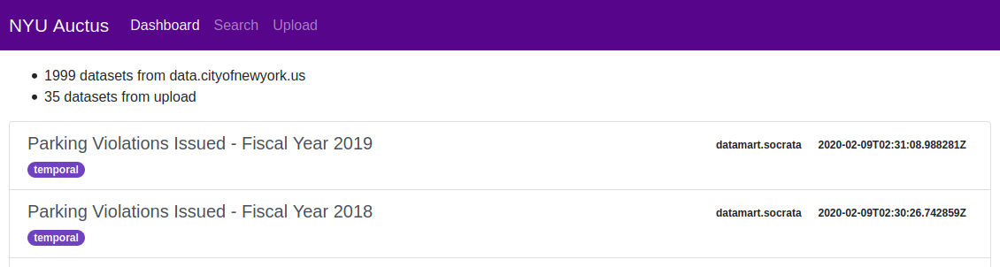

Using the web interface
=======================

In addition to the :doc:`API <restapi>`, there is a web interface allowing users to interact with Datamart with no additional software.

The version of Datamart that we host can be accessed at https://auctus.vida-nyu.org/

Tabs at the top of the page allows you to navigate between the different pages.

Index page
----------

The landing page shows some statistics about the index (the number of datasets per source), as well as a feed of recently ingested datasets. By clicking on a dataset you will be brought to the detailed view for that dataset.

Search page
-----------

This page allows you to query the index for datasets. Here you can enter keyword which will be matched against datasets' names and descriptions, but also add constraints on the dates and times mentioned in the dataset. You can also select a subset of the sources to only display datasets found there.

If you provide data of your own, the system will try to find datasets that can be joined or unioned with your data.

..  figure:: screenshots/search.png

Search results will be displayed at the bottom of the page. Each of them will show its name, description, and size, as well as a links to view its detailed page and to download it in CSV format (additional formats are available from the detailed view).

..  figure:: screenshots/results.png

Detailed page
-------------

This page shows the details about a specific dataset. You can get to it by clicking on a dataset on the index page, or the "View" button for a search result.

At the top are links to download that dataset in specific formats.

Underneath is all the metadata Datamart has about that dataset, such as column type, coverage, description, and materialization information (for :doc:`datamart-materialize <python/datamart-materialize>`).

At the very bottom you will also find a sample from the dataset. That sample is a small number of rows from the data, selected at random. The rows appear in order but are not necessarily consecutive in the original data.
