Using the web interface
=======================

In addition to the `API <../rest/>`__, there is a web interface allowing users to interact with Auctus with no additional software.

The version of Auctus that we host can be accessed at https://auctus.vida-nyu.org/

On each page, clicking on the Auctus logo will bring you back to the search page. Other pages can be accessed using the drop-down menu in the top-right corner:

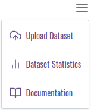

..  _searching:

Searching
---------

This page allows you to query the index for datasets. Here you can enter keyword which will be matched against datasets' names and descriptions, but also add constraints on the dates and times mentioned in the dataset. You can also select a subset of the sources to only display datasets found there.

If you provide data of your own, the system will try to find datasets that can be joined or unioned with your data.

The index page shows the interface from which you can query the index for datasets. You can enter keywords in the search box which will be matched against datasets' names and descriptions, but also add filters that will be matched against a dataset's data.

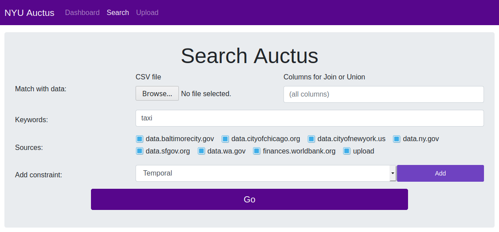

Date filter
***********

The date filter allows you to select a range of dates. Only datasets with a temporal column that overlaps with that range will be shown. In addition, you can select a granularity from the drop-down at the right to further restrict the temporal columns that will be matched.

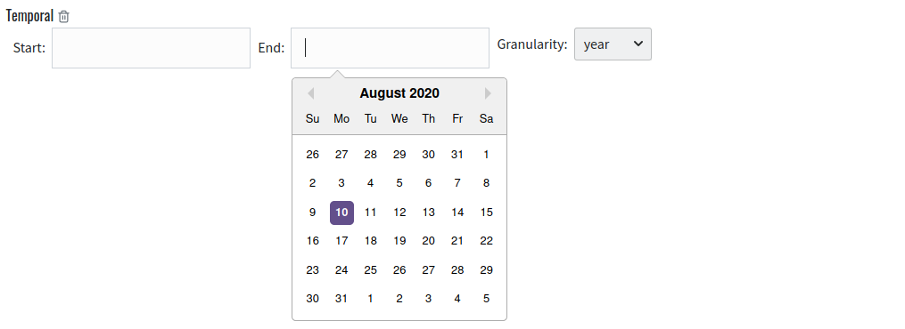

Location filter
***************

The location filter allows you to select a bounding box on a map. Only datasets with a spatial column that overlaps with that area will be shown. Note that you can quickly select an area by name using the search box above the map.

Click and drag to move around, or use two successive clicks to draw a box. Right click removes the box.

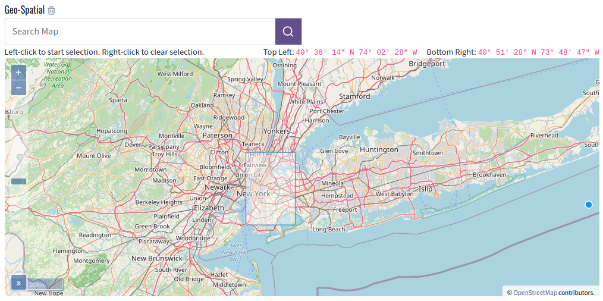

Source filter
*************

The source filter allows you to restrict the data sources you are interested in. Only results from the selected sources will be shown.

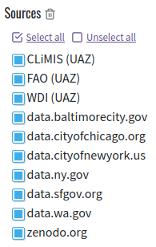

..  _related-file-filter:

Related file filter
*******************

The related file filter allows you to find datasets that can augment your file. Upload a file by selecting one or dragging one over the area. After a few seconds (during which your file is uploaded to Auctus and profiled), you will see some information about your file. After this, only search results that can augment the file you provided will be shown. The supported augmentations are joins (keeping the data you provided and adding more columns to each one of your records) and unions (keeping the data you provided and adding more rows at the end).

In addition, this will cause search results to display the "augment options" button; see :ref:`augment`.

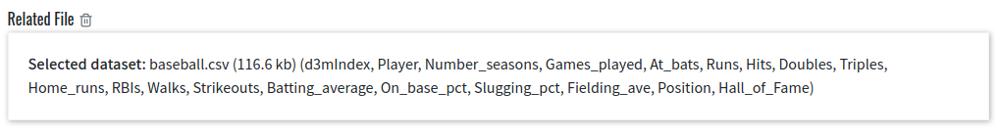

Results page
------------

After submitting a query, you will be presented with the search results page. On that page, the search filters are still present but the filters are collapsed. You can click the "edit" link on each filter to toggle it for editing, and the trash bin icon to remove that filter.

On The left is a list of search results. You can click on "View Details" or the right-pointing arrow to show the details of that result on the right. There you will find the metadata provided with that dataset, as well as the metadata that was automatically extracted by Auctus. You will also see buttons to download the dataset in different formats (currently CSV or D3M).

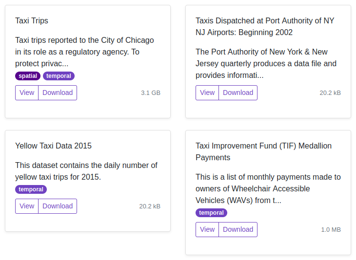

Dataset sample
**************

At the bottom of the detailed view you can find information about the values in the dataset. Use the tabs above the table to switch between the "compact view" (showing minimal information next to the column names, above a sample of rows from the data), the "detail view" (adding a plot showing the distribution of values for each column) and the "column view" (showing detailed statistical information about each column, but no sample of the values themselves).

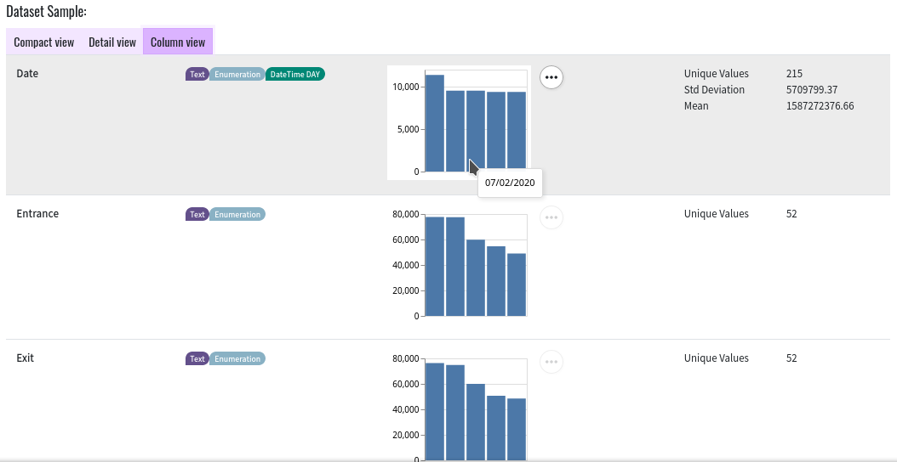

..  _augment:

Augmentation
************

If you provided an input file via the :ref:`related-file-filter`, you will also see a button "Augment Options" under each search result on the left. If you click this button, you will be shown the augmentation interface.

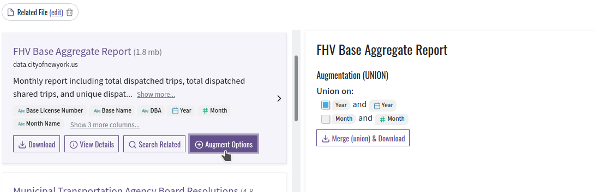

If the search result is a union, you can select matched pairs of columns. The selected columns from the search result (right) will be appended to the matching columns from your input data (left).

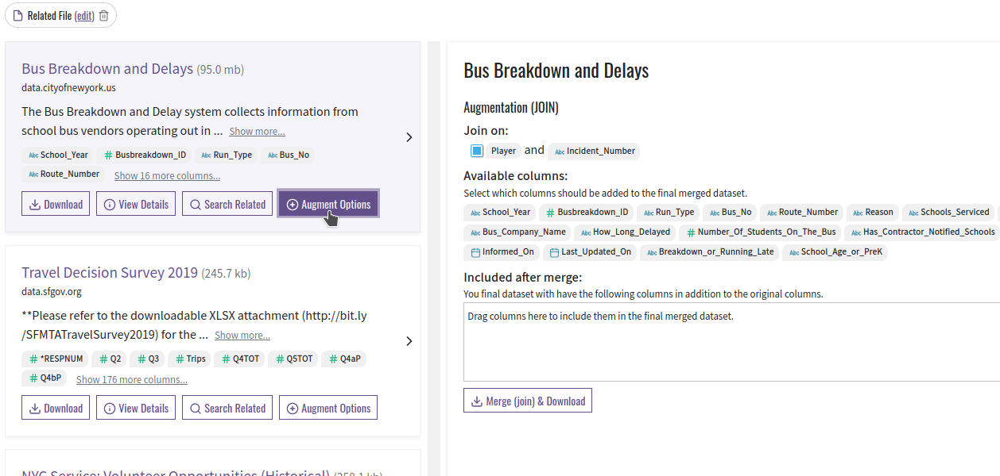

For a join, you can select the columns to match at the top of the augmentation screen. Those are the "join keys" which determine which record from your input data should be matched with each record from the selected search result. Under this area is a drag&drop interface that you can use to include columns from the selected search result into the augmented table. Simply grab a column from the "available columns" area, drag it to the "included after merge" box, and drop it over the aggregation function you wish to use for that column.

Statistics page
---------------

The "statistics" page shows the number of datasets per source as well as a feed of recently ingested datasets. By clicking on a dataset you will be brought to the detailed view for that dataset.

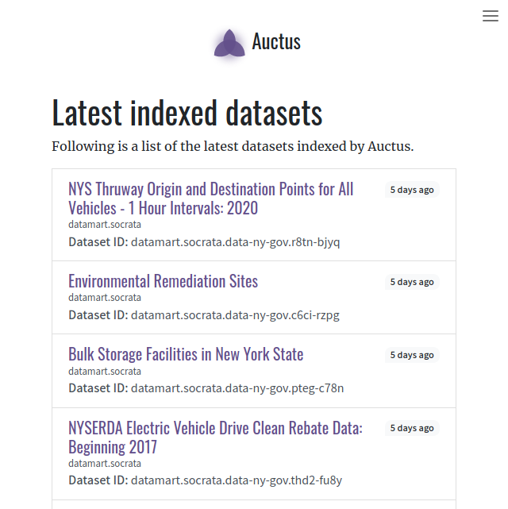

Upload page
-----------

The "upload dataset" page allows users to ingest their own datasets. After loading a data file, Auctus automatically infers the data types for each column using our datamart-profiler library. As any automated method for type inference, our profiler is not fool-proof and can derive incorrect results. To address this limitation, Auctus enables users to correct/refine the type information. Furthermore, users can provide additional annotations for the columns. Auctus also displays a sample of the dataset that can help the user to verify and confirm if the detected data type is correct, and understand what the ingested data looks like. Note that the option to correct/refine profiler results is only available through the "Upload" tab. 

Additionally, Auctus provides support for custom metadata fields (e.g., the data source, grid size). Because such fields can vary widely for different applications and use cases, we defined a flexible configuration schema that allows users to customize the metadata fields required in different deployments. This schema configuration is provided at deployment time  and is then used to add the custom input fields in the interface so that the user can provide the required metadata.

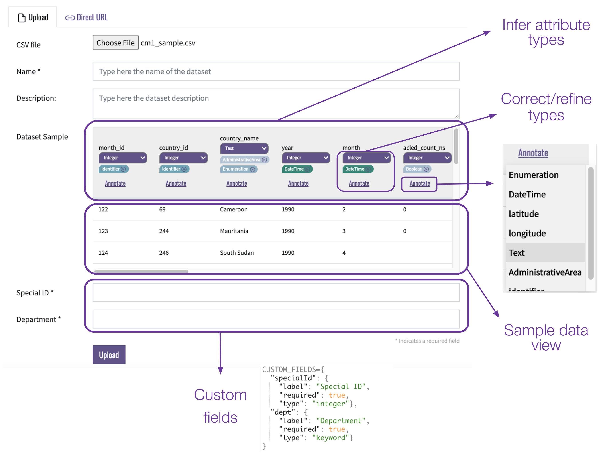
